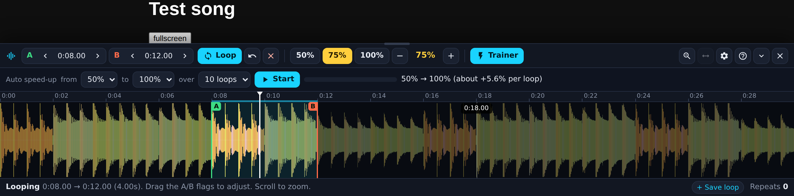

# DJ Wave Looper for YouTube

A Chrome extension for practising music on YouTube. It's made for singers learning by ear and for instrument players.



- **See the whole song as a DJ waveform** in a panel at the bottom of the page. Colours show the sound: orange/red = bass, green = mids, blue = highs.
- **Loop any part:** click where it starts, then click where it ends. It loops forever.
- **Slow it down:** 30%, 50%, 75% and 100% buttons, plus − / + in 5% steps. The key stays the same, so you can still sing along.
- **Speed trainer:** tap **Trainer** and it starts right away, always at 30% over 50 loops (you can switch to 50% / 75% and 25 / 75 loops while it runs). Every loop gets a little faster until 100%, then it plays 10 times at full speed and stops by itself. Tap **Trainer** again to stop it and go back to normal speed. **Too fast?** Press a slower speed while it runs: the trainer steps back to the loop that plays at that speed, so you get those loops again (30% → 100% over 50 loops: 50% = loop 15, 75% = loop 33; 30% starts the climb again with all 50 loops).
- **Lyrics next to the wave:** tap **Lyrics** (♪). It reads the song name from the YouTube title (it ignores words like *Official Video*, *Acapella* or *Instrumental*) and finds the lyrics in [LRCLIB](https://lrclib.net), a free lyrics database. When the lyrics have timings, the current line lights up and scrolls along, and you can tap a line to jump there. **Practise one line:** tap the ⟳ at the left of a line (or the left edge of the line). That line plays 30 times: the first 20 speed up from 30% to 100%, then 10 at 100%, then it stops and your speed goes back to what it was (a running Trainer keeps its place). Tap ⟳ again to stop early: your speed comes back and the song carries on (your A–B loop if you have one). Wrong song? Tap ⏭ for the next match, or type the song name and artist and press Enter. For **a cappella / vocals-only** videos the lyrics line themselves up with where the singing starts; for any version you can fine-tune the timing with **◀ 0.2s / 0.2s ▶** (saved per video).
- **Play / pause button** right in the panel.
- **Pause between loops** (0.5–3 s) to breathe before each repeat.
- **Saved parts** (Verse, Chorus…). Your loop and speed are remembered for every video.

## Install (2 minutes)

1. Download this repository (green **Code** button → **Download ZIP**) and unzip it.
2. Open Chrome and go to `chrome://extensions`.
3. Turn on **Developer mode** (top right).
4. Click **Load unpacked** and pick the unzipped folder (the one with `manifest.json` in it).
5. Open any YouTube video. You'll see a new waveform button in the player controls (bottom right of the video). You can also click the extension icon or press **Alt+L**.

## iPhone and iPad (Safari)

Chrome on iPhone/iPad can't run extensions, so there is a **script version** that runs in Safari through the free **Userscripts** app. Same panel and features, made for fingers:
- **DJ wave:** the wave scrolls under a playhead in the middle. Slide your finger on the wave and the song moves with it, like a record. **A quick tap on the wave pauses / plays.** Holding your finger still holds the song; lift it to play on.
- **A / B buttons:** press **A** where the part starts and a 3-second loop starts right away. Press **B** where it should end. The ‹ › buttons move A or B by 1 second; drag the flags with your finger to fine-tune.
- **Half and half:** the looper takes the bottom half of the screen, the lyrics fill the top half with big words. **A− / A+** change the word size, and the bar under the lyrics drags to make them taller or shorter. The layout button moves the lyrics back beside the wave.
- **Play / pause** button a little bigger than the others.
- **Pinch to zoom**, **Whole song** to see everything, tap the little map under the wave to jump.
- A round floating button opens the looper.

1. Install **Userscripts** from the App Store (free; icon is `</>`).
2. Open the Userscripts app once and tap **Change Userscripts Directory**. Pick a folder, for example *On My iPhone → Userscripts*.
3. Save `wave-looper.user.js` into that folder. Get it from the `userscript` folder of this repo, or from the file sent to you. In Files, *Move* it into the Userscripts folder.
4. Go to **Settings → Apps → Safari → Extensions → Userscripts**. Turn it on and set **Permissions → youtube.com → Allow**. (On older iOS: *Settings → Safari → Extensions*.)
5. Open **youtube.com** in Safari and play a video. Tap the round **waveform button** at the bottom right. If Safari asks, tap **ᴀA → Userscripts → Always Allow on this website**.

Notes:
- **iPad** works best. Safari shows YouTube's desktop site there, the same one the Chrome version was built and tested on.
- **iPhone** uses the mobile site (m.youtube.com). Loop, speed and trainer work. The waveform needs YouTube to stream the audio the same way it does on desktop. If the wave stays empty on your iPhone, the loop and speed still work. Tell me and I'll look into it.
- Videos opened in the **YouTube app** can't be controlled. Use youtube.com in Safari.
- The same file also works in Tampermonkey or Violentmonkey on any desktop browser.

## How to use

| What you want | What to do |
|---|---|
| Make a loop | Click the wave at the start, then click at the end. Or drag across the part. |
| Fine-tune the loop | Drag the green **A** / red **B** flags, or use the ‹ › buttons (0.05 s; Shift = 0.01 s, Alt = 0.5 s). |
| Zoom in / zoom out | Press **Zoom in**: the wave shows only about 30 s around what is playing and scrolls along with the song. Press **Whole song** to see everything again. You can also scroll on the wave to zoom, and 🔍 zooms to your loop. |
| Open the looper | Waveform button in the video controls (bottom right), the **Wave Looper** button under the video next to Like/Share, the extension icon, or **Alt+L**. |
| Make the wave bigger | Press the ↕ buttons (top right of the panel), or drag the top edge of the panel up. |
| Jump somewhere | Click the time ruler at the top of the wave. |
| Set A/B while listening | Press **[** at the start and **]** at the end. |
| Loop on/off | **Loop** button or **\\**. |
| Slow down | **50% / 75% / 100%**, or − / +. Click the big % number to reset to 100%. |
| Speed trainer | Tap **Trainer**: it starts right away at 30% → 100% over 50 loops. Change *from* (30/50/75%) or *over* (25/50/75 loops) any time. After reaching 100% it plays 10 times, then stops by itself. Tap **Trainer** again to stop and go back to normal speed. |
| Lyrics | Tap **Lyrics** (♪). They're found automatically from the song name; the current line lights up when the lyrics have timings. Tap a line to jump there. ⏭ = next match; or type the song name and press Enter. |
| Play / pause | ▶ / ❚❚ button at the left of **Loop**. |
| Breathing pause, pitch | ⚙ settings. Turn **Keep pitch** off for tape-style slow-down (50% = one octave lower, handy for working out fast solos). |
| Undo a loop change | ↶ button. |
| Turn it all off | ✕ closes the panel and resets speed to 100%. |

Space, the arrow keys and every other YouTube shortcut keep working as usual.

### About the waveform "reading"

YouTube only downloads the song a little at a time. The first time you open a song, the looper **reads the whole song**: it plays it muted at high speed for a few seconds (usually 5–20 s), then puts you back exactly where you were. After that the wave is saved, so it shows instantly next time. You can turn this off in ⚙. If you do, the wave fills in as you listen, or you can press **Read whole song** whenever you like.

Works on `www.youtube.com` (watch pages, theatre mode and fullscreen) and `music.youtube.com`.

## For developers

```
src/inject.js     page-world tap: reads the audio YouTube feeds to Media Source Extensions, decodes it, makes waveform peaks
src/content.js    panel UI, loop engine, speed + trainer, scan, storage
src/core.js       pure logic (time format, trainer ramp, PeakStore), unit tested
src/panel-css.js  panel styles (inside a shadow root)
src/background.js toolbar button + Alt+L
```

```
node tools/make-fixtures.js   # test media (needs ffmpeg)
npm test                      # unit tests: logic + WebM/MP4 parsers
npm run e2e                   # loads the real extension in Chromium on a simulated YouTube page (needs playwright)
npm run e2e:userscript        # same 30 steps against the userscript build
npm run e2e:mobile            # userscript on an emulated iPhone visiting m.youtube.com (touch, pinch, layout)
npm run build:userscript      # userscript/wave-looper.user.js (Safari/iOS, Tampermonkey); built from src/
npm run zip                   # dist/dj-wave-looper.zip for the Chrome Web Store
```

The end-to-end test serves a fake YouTube watch page that streams media through MSE the way YouTube does, with YouTube's Trusted Types policy. It covers 39 steps: scan and position restore, waveform accuracy, making the wave bigger, the click-click loop, loop timing (under 80 ms overshoot), speed buttons, YouTube resetting the speed, the trainer ramp, the trainer stopping after N full-speed plays, the button under the video, flag dragging, nudge, undo, zoom, keyboard keys, breath pause, saved parts, the end-of-video guard, switching videos, ads, fullscreen and console errors.
